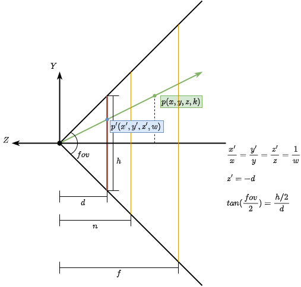

# Perspective (Right Handed)



上图为右手坐标系，相机空间Z轴观察方向为负Z轴（即Z-）方向。
点`P`为光线上的一点，`P`的坐标除以`k`，即表示缩放`k`倍，使得`P`投影在屏幕上。

- 根据线段的缩放有： `x' / x = y' / y = z' / z = 1 / k`, `k = z / d`
- 点`P'`的坐标有：`z' = -d`
- Y轴张角`fov`有：`tan(fov/2) = (h/2) / d = 1 / d` (NDC坐标范围为`[-1, 1]`，故`h=2`)

设投影屏幕的宽高比为`aspect` （投影矩阵需要的参数已经出现2个了：`fov`, `aspect`）。
可以得到：

```
    z' = -1 / tan(fov/2)
    x' = x * z' / z = x * (1 / (aspect * tan(fov/2))) / (-z)
    y' = y * z' / z = y * (1 / tan(fov/2)) / (-z)
```

对于投影矩阵：

- 将`-z`作为`w`，则有`F = -1`
- 缩放x：`Sx = 1 / (aspect * tan(fov))`
- 缩放y：`Sy = 1 / tan(fov)`

(如果只是为了得到投影的`x,y`坐标，算出投影矩阵的`Sx,Sy,F`已经足够了)

```
     Perspective Matrix  *  Pos
    | Sx   0    0    0 |   | x |   | x' |
    | 0    Sy   0    0 | * | y | = | y' |
    | 0    0    Sz   Tz|   | z |   | z' |
    | 0    0    F    0 |   | 1 |   | w  |
```

设投影近平面和远平面的距离为`n`和`f`（投影矩阵剩余的参数也出现了：`n`, `f`）。
投影矩阵需要将`z = -n`映射到`z' = -1`，将`z = -f`映射到`z' = 1`；
同时根据`Perspective * Pos`以及除以`w`（齐次除法得到NDC坐标），有`z' = (z * Sz + Tz) / w = -(z * Sn + Tz) / z`；则有：

- `z' = -1 = (-n * Sz + Tz) / n`
- `z' =  1 = (-f * Sz + Tz) / f`

由此可以解出`Sz,Tz`的解析式：

- `Sz = -(f + n) / (f - n)`
- `Tz = -2 * n * f / (f - n)`


# NDC (Right Handed)

Vulkan的NDC坐标系（右手食指指向X+，中指指向Y+，大姆指指向Z+）：

```
       Z
      /
     /
    *-----> X
    |
    |
    v
    Y
```

- Y轴向下为正方向，所以Vulkan中使用纹理有时需要flip Y轴。
- Culling操作在NDC坐标系进行，Z轴正方向为Front，Z轴负方向为Back，从Front/Back各自方向上再判定ClockWise或CounterClockWise。
- NDC之前的矩阵变换均会影响Culling。
- 集成Vulkan时，常用的flip NDC Y轴的方法：
    - 把flip Y轴的矩阵，合入到投影矩阵中；
    - 使用`VK_KHR_maintenance1`，设置负Height的Viewport来翻转Y轴的映射关系；
